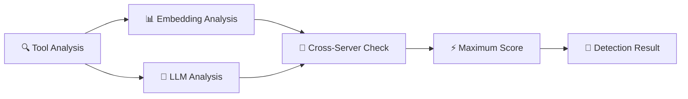

# 🔍 MCP Outlier Scanner

<div align="center">
  
  [](https://www.python.org/)
  [](LICENSE)
  [](https://github.com/YusukeJustinNakajima/mcp-outlier-scanner)
  
  <h3>🛡️ A robust security tool for detecting malicious or misplaced tools in MCP servers using hybrid AI 🤖</h3>
  
</div>

---

## 🚨 Why This Tool is Necessary

### ❌ The Problem with Existing Approaches

<table>
<tr>
<td width="50%">

#### 1️⃣ **Single-Server Analysis Limitations**
- 📍 Most scanners only analyze within single server context
- 🎭 Attackers easily craft legitimate-looking descriptions
- ❌ No cross-server validation
- 🦹‍♂️ Malicious tools hide by mimicking patterns

</td>
<td width="50%">

#### 2️⃣ **LLM-Only Detection Vulnerabilities**
- 🎯 Vulnerable to adversarial prompt engineering
- 🤖 Attackers can deceive LLMs with crafted descriptions
- 📐 Lacks mathematical rigor of embeddings
- ⚠️ No fallback when LLMs are fooled

</td>
</tr>
</table>

### ✅ Our Solution: Hybrid Detection Approach

<div align="center">



</div>

| Feature | Description |
|---------|-------------|
| **🧮 Embedding-based** | Mathematical similarity detection that's hard to fool |
| **🧠 LLM-based** | Semantic understanding for nuanced detection |
| **🔄 Cross-server** | Identifies tools that belong in different servers |
| **📈 Maximum score** | Takes the highest detection score from all methods |

---

## ✨ Features

<div align="center">

| Feature | Description |
|:-------:|:------------|
| 🔍 **Dual Detection** | Combines embedding and LLM analysis |
| 🔄 **Cross-Server Analysis** | Detects misplaced tools across servers |
| 🎯 **Consistency Checking** | Validates descriptions against context |
| ⚡ **Async Scanning** | Fast, concurrent server scanning |
| 🛡️ **FP Warnings** | Alerts on method disagreements |
| 📊 **Multiple Formats** | Text and JSON output options |
| 🔧 **Flexible Config** | Works with or without LLM |

</div>

---

## 🚀 Installation

```bash
# 📥 Clone the repository
git clone https://github.com/YusukeJustinNakajima/mcp-outlier-scanner.git
cd mcp-outlier-scanner

# 📦 Install dependencies
pip install -r requirements.txt
```

### 📋 Requirements

- ✅ **Python 3.8+**
- ✅ **Claude Desktop** with configured MCP servers
- 💡 **Optional:** OpenAI API key for LLM-enhanced detection

---

## 📖 Usage

### 🎯 Basic Usage

```bash
# 🔍 Scan with default methods (consistency + cross-server)
python mcp_scanner.py

# 🤖 Enable LLM-enhanced detection
python mcp_scanner.py --use-ai

# 🎯 Use specific detection method
python mcp_scanner.py --methods consistency
```

### 🚀 Advanced Usage

```bash
# 🔑 Set API key via environment variable
export OPENAI_API_KEY=your-api-key
python mcp_scanner.py --use-ai

# 💾 Save results to JSON file
python mcp_scanner.py --output json --save results.json

# 🐛 Debug mode with detailed output
python mcp_scanner.py --debug --use-ai

# ⏱️ Custom timeout for slow servers
python mcp_scanner.py --timeout 60
```

### ⚙️ Command Line Options

| Option | Description |
|--------|-------------|
| `--config PATH` | Path to Claude Desktop config file |
| `--timeout SEC` | Timeout for server scanning (default: 30) |
| `--use-ai` | Enable AI/LLM for enhanced detection |
| `--api-key KEY` | OpenAI API key for LLM detection |
| `--output {text,json}` | Output format (default: text) |
| `--save FILE` | Save report to specified file |
| `--debug` | Enable debug output |
| `--methods METHOD` | Detection methods: consistency, cross-server, multi, ai |

---

## 🔬 Detection Methods

### 1️⃣ Consistency Check
<table>
<tr>
<td>

**🧮 Embedding Analysis**
- Measures semantic alignment
- Tool name vs description
- Server context validation

</td>
<td>

**🤖 LLM Analysis**
- Evaluates tool consistency
- Server purpose matching
- Pattern analysis

</td>
<td>

**⚡ Hybrid Scoring**
- Maximum of both methods
- Catches evasion attempts
- Robust detection

</td>
</tr>
</table>

### 2️⃣ Cross-Server Analysis
<table>
<tr>
<td>

**🧮 Embedding Analysis**
- Vector similarity comparison
- Cross-server validation
- Mathematical rigor

</td>
<td>

**🤖 LLM Analysis**
- Semantic understanding
- Best-fit server detection
- Context awareness

</td>
<td>

**🚨 Critical Features**
- Finds cross-server attacks(tool shadowing)
- Maximum score principle

</td>
</tr>
</table>

---

## 📊 Output Format

### 📝 Text Output (Default)
```ansi
[DEVIATION] suspicious_tool (from mcp-server)
  Confidence: 85.00%
  Reason:
    📊 Detection Scores - Embedding: 0.60, LLM: 0.85 (Max: 0.85)
    🔍 Embedding Analysis:
      • Tool description has weak semantic alignment with its context
    🤖 LLM Analysis:
      • Poor alignment with server purpose (score: 0.25)
      • Much better fit with 'other-server' (LLM: 0.90 vs 0.25, diff: +0.65)
  ⚠️  HIGH RISK: Review this tool immediately
  Recommendation: Investigate why this tool exists in the mcp-server server
```

### 📋 JSON Output
```json
{
  "scan_timestamp": "2024-01-20T10:30:00",
  "summary": {
    "total_servers": 5,
    "successful_scans": 5,
    "total_tools": 47,
    "deviations_found": 2
  },
  "deviations": [...]
}
```

---

## 🏗️ Architecture

```
mcp-outlier-scanner/
├── 🎯 mcp_scanner.py              # Main entry point
├── 📊 models.py                   # Data models
├── ⚙️  config_loader.py           # Configuration handling
├── 📡 server_scanner.py           # MCP server communication
├── 🎮 detector_manager.py         # Detection orchestration
├── 📝 report_generator.py         # Output formatting
├── 🔧 utils.py                    # Utilities
└── 🔍 detectors/
    ├── 🏗️  base_detector.py       # Base detector class
    ├── 🎯 consistency_detector.py # Consistency checking
    └── 🔄 crossserver_detector.py # Cross-server analysis
```

---

## 🤝 Contributing

<div align="center">

**Contributions are welcome! Please feel free to submit a Pull Request.**

</div>

### 👨‍💻 Development Setup

```bash
# 📥 Clone repository
git clone https://github.com/YusukeJustinNakajima/mcp-outlier-scanner.git
cd mcp-outlier-scanner

# 🐍 Create virtual environment
python -m venv venv
source venv/bin/activate  # On Windows: venv\Scripts\activate

# 📦 Install dependencies
pip install -r requirements.txt
```

---

## 📄 License

<div align="center">

**MIT License** - see [LICENSE](LICENSE) file for details

</div>

---

<div align="center">

**⚠️ Note**: This tool is designed for defensive security purposes. Always ensure you have permission before scanning MCP servers.

<br>

Made with ❤️ for MCP Security

</div>